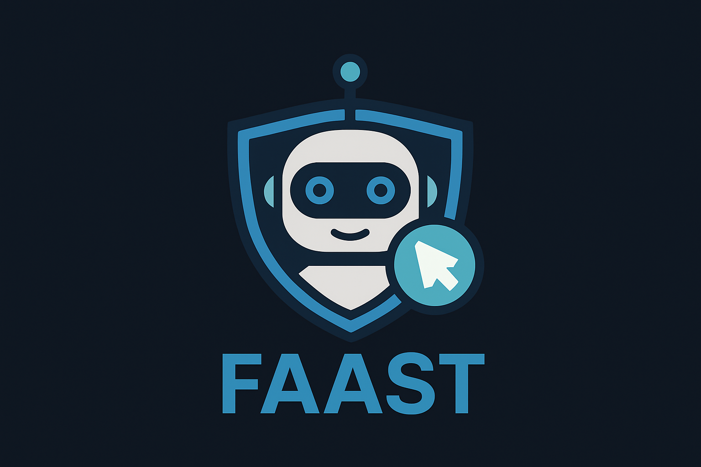

# FAAST: Full Agentic Application Security Testing

[](https://opensource.org/licenses/MIT)
[](https://github.com/marcostolosa/faast/graphs/commit-activity)
[](https://www.python.org/)
[](https://GitHub.com/marcostolosa/faast)

<p align="center">
  
  <br>
  <i>A próxima geração de teste de segurança de aplicações</i>
</p>

## O que é FAAST?

**FAAST** (Full Agentic Application Security Testing) é uma plataforma open-source revolucionária que combina análise estática (SAST), análise dinâmica (DAST) e validação prática de vulnerabilidades usando modelos de linguagem grandes (LLMs) em um único agente autônomo.

> 💡 **FAAST usa IA para conectar, correlacionar e confirmar vulnerabilidades - eliminando falsos positivos e gerando relatórios acionáveis.**

## 🔥 Recursos Principais

- **SAST Inteligente**: Análise estática de código usando inicialmente Semgrep e Bandit, com interpretação automática dos resultados por LLMs
- **DAST Adaptativo**: Testes dinâmicos com OWASP ZAP e sqlmap, entre outras ferramentas, direcionados pelos achados da análise estática
- **Validação Automática**: Confirmação prática das vulnerabilidades em ambiente containerizado
- **Mapeamento Avançado**: Correlação automática de vulnerabilidades com CVE, CWE, CAPEC e MITRE ATT&CK
- **Relatórios Contextualmente Ricos**: Explicações claras e recomendações de correção geradas por IA


## 🚀 Começando

### Pré-requisitos

- Docker e Docker Compose
- Python 3.9+
- Chave de API para GPT-4o (OpenAI)

### Instalação e Uso

1. Clone o repositório:
```bash
git clone https://github.com/marcostolosa/faast.git
cd faast
```

2. Configure as variáveis de ambiente:
```bash
cp .env.example .env
# Edite o arquivo .env com sua chave de API
```

3. Inicie o ambiente FAAST:
```bash
docker-compose up -d
```

4. Execute o agente no aplicativo de exemplo:
```bash
python -m faast_agent.main --target targets/flask_vulnerable_app
```

5. Veja os relatórios gerados em `data/reports/`

## 🔍 Como Funciona

1. **Fase SAST**: O código é analisado estaticamente para identificar potenciais vulnerabilidades
2. **Análise via LLM**: Um agente baseado em GPT-4o analisa os resultados e prioriza os problemas
3. **Fase DAST**: Testes dinâmicos são direcionados aos pontos vulneráveis detectados
4. **Validação**: O agente tenta confirmar as vulnerabilidades em ambiente containerizado
5. **Relatório**: Geração de relatório detalhado com mapeamento para frameworks de segurança

## 🤝 Contribuindo

Contribuições são bem-vindas! Veja [CONTRIBUTING.md](CONTRIBUTING.md) para detalhes.

### Áreas para Contribuição

- Suporte a novas linguagens de programação
- Integração com mais ferramentas SAST/DAST
- Melhorias no agente LLM
- Testes e correção de bugs

## 📋 Status do Projeto

FAAST está atualmente em fase de **Proof of Concept**. Veja nosso [Roadmap](docs/ROADMAP.md) para conhecer os planos futuros.

## 📜 Licença

Este projeto está licenciado sob a MIT License - veja o arquivo [LICENSE](LICENSE) para detalhes.

## 🔗 Links Úteis

- [Documentação Completa](docs/overview.md)
- [Tutorial em Vídeo](https://youtube.com/placeholder)
- [Blog sobre a Arquitetura do FAAST](docs/blog_post.md)
