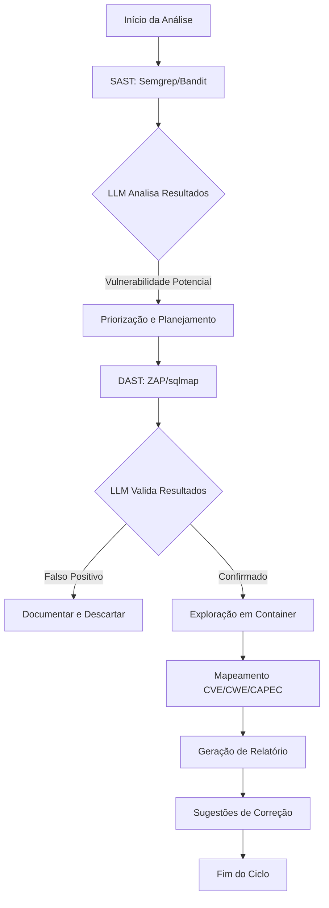

# FAAST: Visão Geral Técnica

## Introdução

FAAST (Full Agentic Application Security Testing) representa uma evolução significativa no cenário de segurança de aplicações, combinando análise estática de código (SAST), testes dinâmicos de segurança (DAST) e modelos de linguagem avançados em uma plataforma unificada e agentic.

Enquanto ferramentas tradicionais tratam SAST e DAST como disciplinas separadas - gerando silos de informação, falsos positivos e sobrecarga cognitiva para os analistas - FAAST implementa um fluxo de trabalho integrado e orquestrado por inteligência artificial.

## FAAST vs. Soluções Existentes

| Característica | FAAST | OWASP ZAP | Veracode |
|----------------|-------|-----------|----------|
| **Tipo** | Agentic (SAST+DAST) | DAST | SAST+DAST (não integrados) |
| **Integração SAST/DAST** | Nativa, dirigida por LLM | Não possui | Parcial, manual |
| **Validação Automática** | Sim | Não | Limitada |
| **Mapeamento MITRE/CAPEC** | Automático via CVE2CAPEC | Não | Limitado |
| **Containers Integrados** | Sim | Não | Não |
| **Open Source** | Totalmente | Totalmente | Não |
| **Sugestões de Correção** | Geradas por IA | Estáticas | Estáticas |
| **Falsos Positivos** | Reduzidos via validação | Comuns | Comuns |

## Tecnologias Utilizadas

### SAST (Análise Estática)
- **Semgrep**: Engine principal para análise estática multi-linguagem
- **Bandit**: Análise específica para código Python
- **Custom Parsers**: Para linguagens adicionais e frameworks específicos

### DAST (Análise Dinâmica)
- **OWASP ZAP**: Scanner de segurança de aplicações Web
- **sqlmap**: Detecção e exploração de vulnerabilidades de SQL Injection
- **Custom Scripts**: Para validação de XSS, SSRF e outras vulnerabilidades

### LLM & Orquestração
- **GPT-4/Claude**: Para análise de resultados, geração de exploits e sugestões de correção
- **LangChain**: Framework para construção do agente e fluxos de raciocínio
- **Vector DB**: Para armazenamento de conhecimento em segurança e correlação

### Mapeamento e Contextualização
- **CVE2CAPEC**: Integração com o projeto Galeax/CVE2CAPEC
- **MITRE ATT&CK**: Para contextualização tática das vulnerabilidades
- **CWE/CAPEC**: Para classificação padronizada de fraquezas e padrões de ataque

### Infraestrutura
- **Docker/Docker Compose**: Para containerização e isolamento
- **Flask/FastAPI**: Para serviços internos e API
- **MongoDB/SQLite**: Para armazenamento de dados e resultados

## Fluxo de Execução do Agente FAAST



## Funcionamento Detalhado

### 1. Ingestão e Preparação
O agente FAAST inicia com a análise do codebase alvo, identificando linguagens, frameworks e padrões arquitecturais. Um ambiente containerizado é preparado para testes dinâmicos posteriores.

### 2. Fase SAST
Ferramentas de análise estática (Semgrep, Bandit) são executadas contra o código-fonte, gerando um conjunto inicial de potenciais vulnerabilidades.

### 3. Análise via LLM
O agente LLM analisa os resultados SAST, removendo falsos positivos óbvios, correlacionando problemas relacionados e priorizando baseado na criticidade potencial. O LLM desenvolve um "plano de ataque" para validação.

### 4. Fase DAST
Baseado no plano gerado, ferramentas DAST são configuradas para testar especificamente os endpoints e padrões identificados como potencialmente vulneráveis.

### 5. Validação Automática
O agente tenta confirmar as vulnerabilidades através de exploração controlada no ambiente containerizado, confirmando assim a existência real do problema.

### 6. Contextualização e Mapeamento
Vulnerabilidades confirmadas são mapeadas para CVEs relevantes, CWEs, padrões CAPEC e táticas MITRE ATT&CK, usando o framework CVE2CAPEC.

### 7. Relatório e Remediação
Um relatório detalhado é gerado, incluindo evidências, impacto, mapeamentos de segurança e sugestões de correção específicas geradas pelo LLM, com base nas melhores práticas.

## Diagrama da Arquitetura

```
┌─────────────────────────────────────────┐
│             FAAST Agent                 │
│  ┌─────────────┐      ┌─────────────┐   │
│  │   SAST      │      │    DAST     │   │
│  │  Module     │ ───▶│   Module    │   │
│  └─────────────┘      └─────────────┘   │
│         │                    │          │
│         ▼                    ▼          │
│  ┌─────────────────────────────────┐    │
│  │          LLM Engine             │    │
│  │    (GPT-4, LangChain)           │    │
│  └─────────────────────────────────┘    │
│         │                    │          │
│         ▼                    ▼          │
│  ┌─────────────┐       ┌─────────────┐  │
│  │ CVE2CAPEC   │       │ Container   │  │
│  │  Mapper     │◀────▶│ Orchestrator│  │
│  └─────────────┘       └─────────────┘  │
└─────────────────────────────────────────┘
            │                    │
            ▼                    ▼
┌─────────────────┐      ┌─────────────────┐
│  Knowledge DB   │      │  Target Apps    │
│ (Vector Store)  │      │  (Containers)   │
└─────────────────┘      └─────────────────┘
            │                    │
            ▼                    ▼
      ┌─────────────────────────────┐
      │        FAAST Reports        │
      │ (Markdown, JSON, PDF)       │
      └─────────────────────────────┘
```

## Casos de Uso Principais

1. **DevSecOps Integration**: Detectar vulnerabilidades durante CI/CD
2. **Audit Automation**: Automatizar testes de penetração recorrentes
3. **Security Education**: Ambiente de aprendizado e treinamento
4. **Vulnerability Research**: Pesquisa de novos padrões de vulnerabilidade

## Limitações Atuais

- Suporte limitado a certas linguagens e frameworks
- Desempenho do LLM em codebases muito grandes
- Necessidade de refinamento dos prompts para análise precisa
- Dependência de APIs comerciais para LLM (OpenAI/Anthropic)

## Roadmap Futuro

Veja o arquivo [ROADMAP.md](ROADMAP.md) para detalhes completos sobre os planos de desenvolvimento futuros para o FAAST.